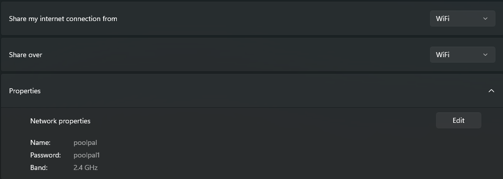
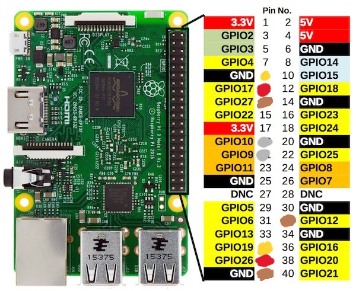

# **PoolPal**

## About

PoolPal is a project created during the University of Edinburgh's System Design Project course. Developed over a roughly 10 week period, PoolPal is designed to allow for remote play on a real pool table.

## Members

- Josh Newham - _Project manager, app team_
- Hugo Arbones - _Gantry, electronics, motor_control code_
- Oliver Hill - _Gantry, electronics, hitting mechanism_
- Gabriel MacCallum - _Hitting mechanism_
- Fergus Gault - _Computer vision_
- David Zhang Chen - _Table, app team_
- Matthew Zhang - _App team_

## Installation

Please note: **The installation and usage process could take at least 30 minutes for someone unfamiliar with the project.**

Clone the repository

```bash
git clone https://github.com/Fergus-Gault/poolpal.git
cd poolpal
```

Create a virtual environment with Python 3.12. (You may need to run `source activate base` before activating `poolpal`)

```bash
conda create -y -n poolpal python=3.12
conda activate poolpal
```

Download requirements (may take a while).

```bash
pip install -r requirements.txt
```

You will require 2 terminals within the `poolpal` environment and a 3rd for ssh.

## Usage

### **Step 0 - Prerequisites**

To successfully run Poolpal you must have installed/have access to:

- Arduino IDE (For setting the correct port)
- Mobile hotspot (Works best as WIFI relay from Windows)
- Ability to SSH into remote devices
- 10-battery pack (For powering hitting mechanism)
- Power bank (For powering Raspberry Pi)

### **Step 1 - Connection**

- Connect both USB cables to your computer (black and white ones)
- Connect the loose wires to a 12V power supply (**Brown wire in +, yellow in -**)

### **Step 2 - Computer Vision**

- First figure out which port on your devices the camera is connected to. If you are using Windows this is likely a number in the range 0-10 (Likely 0 or 1). If you are using Linux then run `v4l2-ctl --list-devices` and find the correct `/dev/video?` path.
- Run computer vision:

```bash
python computer_vision/main.py --camera-port [port] --no-interface
```

- `--no-interface` - Disables the [LiveConfig](https://github.com/Fergus-Gault/liveconfig) interface as this project comes pre-configured. Exclude this argument if you wish to modify variables.

### **Step 3 - Gantry**

- Launch the Arduino IDE and ensure that you are connected to the arduino.
- Open `motor_control/gantry_controller.py` and modify line 19:

```python
ser = serial.Serial([port], 115200)
```

where [port] is the port seen in the Arduino IDE

- Run the gantry motor_controller

```bash
python motor_control/gantry_controller.py
```

### **Step 4 - Hitting mechanism**

Now you can finally setup the hitting mechanism. **It is important these steps are done in order**.

1. Set up a mobile hotspot
    - Name: `poolpal`
    - Password: `poolpal1`
    - Network band: `2.4 GHz` (If applicable)
    - If using a phone then you may need to rename your phone to `poolpal` and must also connect your computer to that mobile hotspot.
    - This is significantly easier using a Windows laptop and sharing your connection from WIFI over WIFI.
    

2. Take yellow side panel of enclosure off.
3. Check Raspberry Pi wires are correctly attached, and that there are no other loose wires. The single brown wire is prone to coming out of place. It should be in **GPIO 12** (see below).


4. Connect the power bank to the USB cable and place it on top of the motor in the black half of the enclosure. Ensure this does not interfere with the hitting mechanism itself, you may need to use bluetack to prop it up enough.
5. Check for a connection on your hotspot called `poolpal`.
6. Reattach the yellow side panel, ensuring no wires are blocking the path of the hitting mechanism.
7. Connect the battery pack to the connector and place on yellow side panel, next to the raspberry pi.
8. SSH into the raspberry pi with:

```bash
ssh poolpal@poolpal
```

with password: `poolpal`.
You do not need to do anything when connected.

### **Step 5 - Play**

- Go to the [PoolPal app](http://poolpal.joshn.uk/app/index.html) to play using the web interface!

## **Common issues**

### Hitting mechanism moves forward but does not release

- The brown wire on the Raspberry Pi is disconnected, ensure it is in **GPIO 12**.

### Hitting mechanism is struggling to move upwards after making a shot

- The batteries are low, replace them.

### Table is misaligned in the computer vision

- Reset the table points by deleting `computer_vision/src/data/table_pts.json` and restarting the program.
- This will prompt you to manually reselect the corners of the table.
- Select 4 points so that only the playing surface of the table is within the rectangle that is created when all 4 points are selected.
    

### Gantry is not moving

- Double check the emergency button is not pressed, as this stops all power from reaching the stepper motors.
- Ensure no loose wires within the wiring box.

### Arduino was reset

- Flash `motor_control/main/main.ino` to the Arduino.

### The Raspberry Pi has not connected to the hostpot

- As with nearly all things related to the Raspberry Pi not working, the best idea is to take of the yellow side panel, and disconnect the power from the Raspberry Pi. Wait a few seconds and then repeat step 3 of the hitting mechanism setup onwards.
