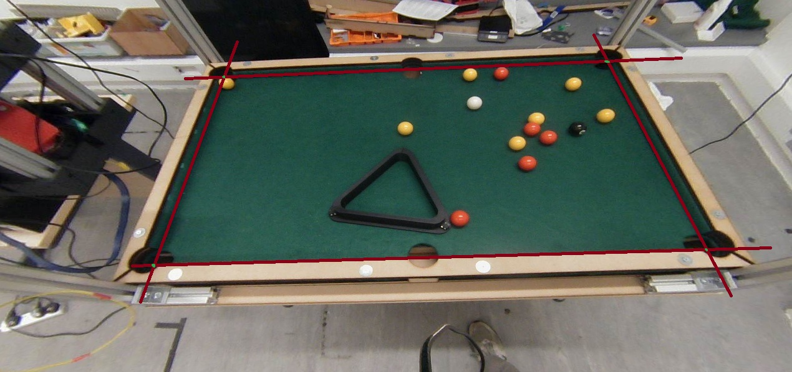

# **Pool ball tracker** #

## Overview ##

This project performs real-time pool ball detection using a YOLO12n model. It was built as part of the [Pool Pal](https://informatics.ed.ac.uk/news-events/latest-news/informatics-students-showcase-innovative-assistive-robotics-at-sdp-trade) project. This version is an expansion on the original software, adding improved performance, and greater customisability.

### Features ###

- **Real-time pool ball detection**
- **Obstruction detection**
- **Communication with a pub/sub server**

## Usage ##

Clone the repository

```bash
git clone https://github.com/Fergus-Gault/pool_ball_tracker.git
```

Install requirements

```bash
pip install -r requirements.txt
```

Run program

```bash
python main.py
```

## Configuration ##

Most options can be modified in real-time using the [LiveConfig](https://pypi.org/project/liveconfig/) interface. Access through `http://localhost:5000`

### Point selection ###

Select points using the interface as show below:



Aim to select the points where the lines run parallel to the edge of the table surface.

Press `BACKSPACE` to remove a selected point and `ENTER` to confirm points.

### Runtime arguments ###

- `--no-interface` - Run without the LiveConfig interface
- `--file <path>` - Run with an image instead of a live video

## License ##

[MIT](https://choosealicense.com/licenses/mit/)
